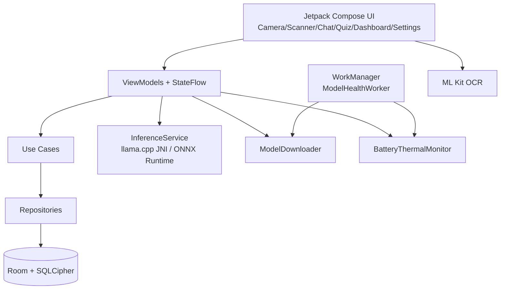

# EdgeAI Tutor Lite Architecture

## Modules
- `app`: UI + DI + feature screens + local services
- `service/ai`: model inference, download, model selection
- `service/device`: battery/thermal throttling hooks
- `data/local`: offline encrypted persistence

## Offline Policy
- No inference network calls.
- After model download, all tutoring runs locally.
- Analytics is explicit opt-in and anonymized.
